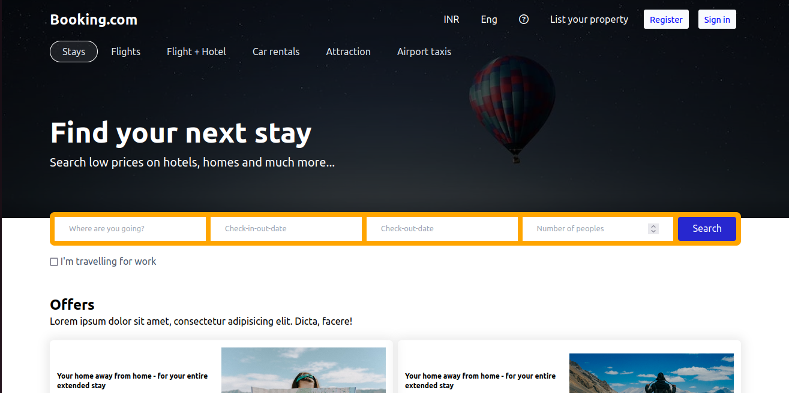

# Booking.com Clone



This project is a clone of the popular travel booking website Booking.com, created using React. In this clone there's exist only front end part of the website.

## Features

- User-friendly interface for browsing and booking travel services.
- Resposive website.

## Demo

You can explore the live demo of this Booking.com clone at [Demo](https://master.d28ddlfr46llsq.amplifyapp.com/).

## Getting Started

To run this project locally, follow these steps:

1. Clone this repository:

```bash
git clone https://github.com/anand-jaiswal-IN/booking-clone.git
```

2. Navigate to the project folder:

```bash
cd booking-clone
```

3. Install dependencies:

```bash
npm install
```

4. Start the development server:

```bash
npm start
```

5. Open your browser and go to [http://localhost:3000](http://localhost:3000) to view the application.

## Contributing

Contributions to this project are welcome. If you'd like to contribute, please follow these steps:

1. Fork the repository.

2. Create a new branch for your feature or bug fix:

```bash
git checkout -b feature/my-feature
```

3. Make your changes and commit them:

```bash
git commit -m "Add a new feature"
```

4. Push your branch to your forked repository:

```bash
git push origin feature/my-feature
```

5. Open a pull request on the original repository, explaining your changes.

## Contact
If you have any questions or suggestions, feel free to contact the project maintainer:

Anand Jaiswal
anandjaiswal68339@gmail.com

